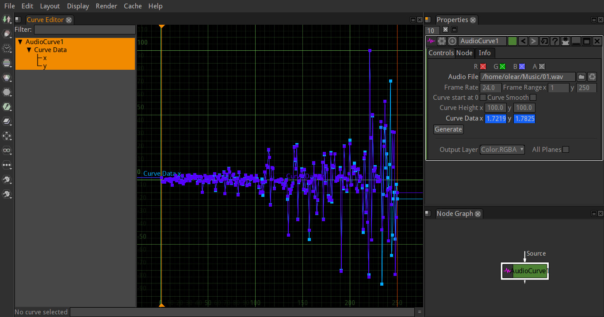

# AudioCurve.ofx

OpenFX Audio Curve Generator.



## Build and install *(Linux)*

### Requirements

* libsox
* OpenGL
* cmake *(3.1+)* *(make depend)*
* pkg-config/pkgconf *(make depend)*

```
git clone https://github.com/NatronGitHub/openfx-arena
cd openfx-arena
git submodule update -i --recursive
cd AudioCurve
mkdir build && cd build
cmake -DCMAKE_INSTALL_PREFIX=/usr/OFX/Plugins ..
make
sudo make install
```

## Build for Windows *(on Linux/macOS)*

### Requirements

 * [MXE](https://mxe.cc/#requirements)


```
git clone https://github.com/NatronGitHub/openfx-arena
cd openfx-arena
git submodule update -i --recursive
cd AudioCurve
git clone https://github.com/mxe/mxe
cd mxe
make MXE_TARGETS=x86_64-w64-mingw32.static cc cmake sox
export PATH=`pwd`/usr/bin:$PATH
export PKG_CONFIG_PATH=`pwd`/usr/x86_64-w64-mingw32.static/lib/pkgconfig
cd ..
```
```
mkdir build && cd build
x86_64-w64-mingw32.static-cmake -DDEPLOY=ON -DCMAKE_INSTALL_PREFIX=/ ..
make
x86_64-w64-mingw32.static-strip -s AudioCurve.ofx
make DESTDIR=`pwd`/pkg install
```

## License *(LGPL)*

```
Copyright (C) 2019 Ole-André Rodlie <ole.andre.rodlie@gmail.com>

This program is free software; you can redistribute it and/or
modify it under the terms of the GNU Lesser General Public
License as published by the Free Software Foundation; either
version 2.1 of the License, or (at your option) any later version.

This program is distributed in the hope that it will be useful,
but WITHOUT ANY WARRANTY; without even the implied warranty of
MERCHANTABILITY or FITNESS FOR A PARTICULAR PURPOSE.  See the GNU
Lesser General Public License for more details.
```
